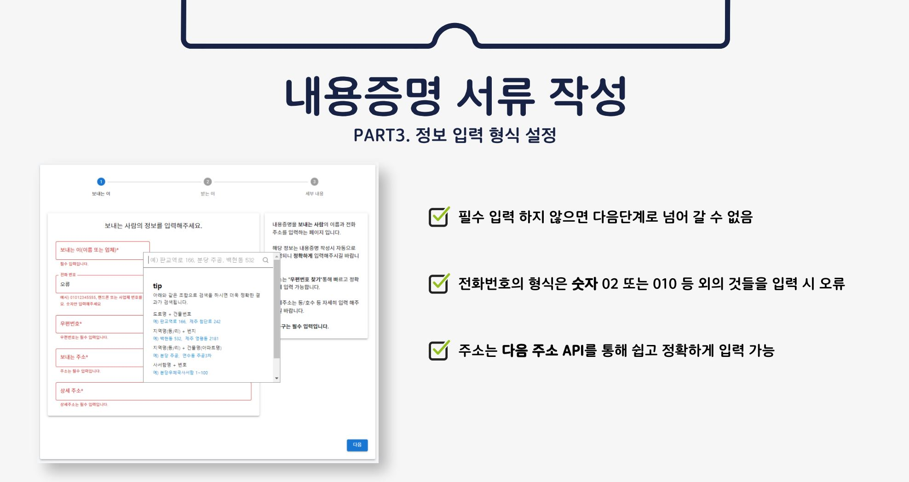

# 박상현

<div align="center">

  <h1>법률 언어 생성현 모델을 활용한 생활 법률 지원 서비스</h1>
  
  <!-- <p>
    An awesome README template for your projects! 
  </p> -->
</div>

<!-- About the Project -->

## :star2: 배포 링크

<a href='https://lawable.vercel.app/'>배포 사이트</a> **: 서버 운영의 어려움으로 프론트엔드 페이지만 배포**

## :camera: 데모 영상 : 유튜브 링크

## [](https://youtu.be/4NAUn0JS17Q) : 전체적인 시연영상입니다.

## 역할 분담

- 프론트엔드 3명 (<strong>CHAT, WRITE 페이지 담당</strong>)
- 백엔드 2명
- AI모델 2명

### 담당 파트

- src/components/chat
- src/components/PostCode
- src/components/write
- src/components/scrollToTop.jsx
- src/page/chat
- src/page/write
  <br/>

## 아키텍쳐


### 개발 기간

- 계획 수립 및 시나리오 설계, 데이터 수집: 23.05.30 ~ 23.06.13
- 시스템 개발 및 통합, 테스트: ~ 23.07.06(약 3주)

### :dart: 특징

- API를 통해 model flask 서버와 django 서버 통신
- formik을 통해 서류 작성 입력 양식 유효성 체크 (src/components/write/FormModel)
- react-daum-postcode을 이용 modal창을 띄어 주소 자동 입력.
- mui Stepper를 통해 내용증명 작성 진행도 파악.

<!-- 사용 기술 스택 -->

### :space_invader: Tech Stack

<details>
  <summary>Client</summary>
  <ul>
    <li><a href="https://reactjs.org/">React.js</a></li>
    <li><a href="https://reactrouter.com/en/main/">react-router-dom</a></li>
    <li><a href="https://mui.com/material-ui/">mui/material 5.13.5</a></li>
    <li><a href="https://formik.org/">formik 2.4.2</a></li>
  </ul>
</details>

<details>
<summary>CI/CD</summary>
  <ul>
    <li><a href="https://vercel.com/">vercel</a></li>
  </ul>
</details>

## <!-- Getting Started -->

## :toolbox: Getting Started

### :running: Run Locally

Clone the project

```bash
  git clone clone https://github.com/PARKmaker/lawABLE.git
```

Go to the project directory

```bash
  cd lawABLE
```

Install dependencies

```bash
  npm install
```

Start the server

```bash
  npm start
```

## :grey_question: 개발하면서 고민한점

- 서버와 통신할때(POST, GET) Promise 객체로 반환되고, 빈값으로 받아지는 문제점 -> asnyc await를 통해 해결
- "다음 주소 api"를 통해 값을 입력할 때 ui에는 적용 되지만 formik의 유효성 검사를 통과 하지 못하는 문제점
  -> "다음 주소 api" 컨포넌트가 실행될때만 작동하게 useEffect 함수를 이용하고, formik의 helper 객체의 setValue 함수를 이용하여 해결
  -> 이때 useEffect deps에 값이 입력될때만 작동시킬 수 있도록 주소값 변수를 넣기(그렇지 않으면 무한 실행 되어 서버 다운)

## 화면 이미지와 기능 정리





